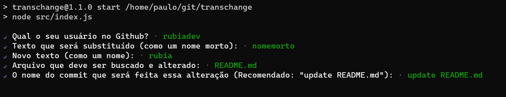

## Transchange

Transchange é um programa criado para pessoas transgênero desenvolvedoras que precisam ter o trabalho de mudar as referências aos seus nomes em seus repositórios no Github, mas teriam muito trabalho para fazer isso manualmente, e também seria um processo doloroso ter que ficar lendo e corrigindo seu nome morto.

Por isso, criei esse utilitário de linha de comando para fazer essa alteração de maneira **automática** em **todos** os repositórios de alguém, tornando este processo pelo menos um pouco menos amargo.

## Requisitos

Para utilizar o Transchange, é necessário ter o `git` de linha de comando instalado.

## Instalação

Para instalar o Transchange de maneira simples, use o comando abaixo:

```
npm install -g transchange
```

Caso dê um erro relacionado á permissão, adicione um `sudo` antes, como no comando abaixo:

```
sudo npm install -g transchange
```

## Uso

Execute o transchange através do seguinte comando no terminal:

```
transchange
```

Caso dê um erro relacionado á permissão, adicione um `sudo` antes, como no comando abaixo:

```
sudo transchange
```

Para utilizar o transchange, é necessário passar cinco parâmetros no terminal interativo:

1. Seu usuário no Github;
1. Texto antigo (como um nome morto);
1. Texto novo (como um nome);
1. Arquivo que deve ser mudado (README.md, LICENSE, etc.)
    - Valor default é `README.md`.
1. O nome do commit que será feita essa alteração (**Recomendo esconder essa mudança com um commit chamado `update README`**)
    - Valor default é `update README.md`.



> Esse comando pode ser repetido várias vezes mudando o arquivo que você deseja editar.

## Contribuições

O projeto aceita de braços abertos contribuições que possam ser feitas, tanto no código quanto fora dele, mas principalmente, divulgue o projeto para que mais pessoas trans tenham acesso, e menos dor em pelo menos um único aspecto de um processo tão amargo quanto fel. :heart:
